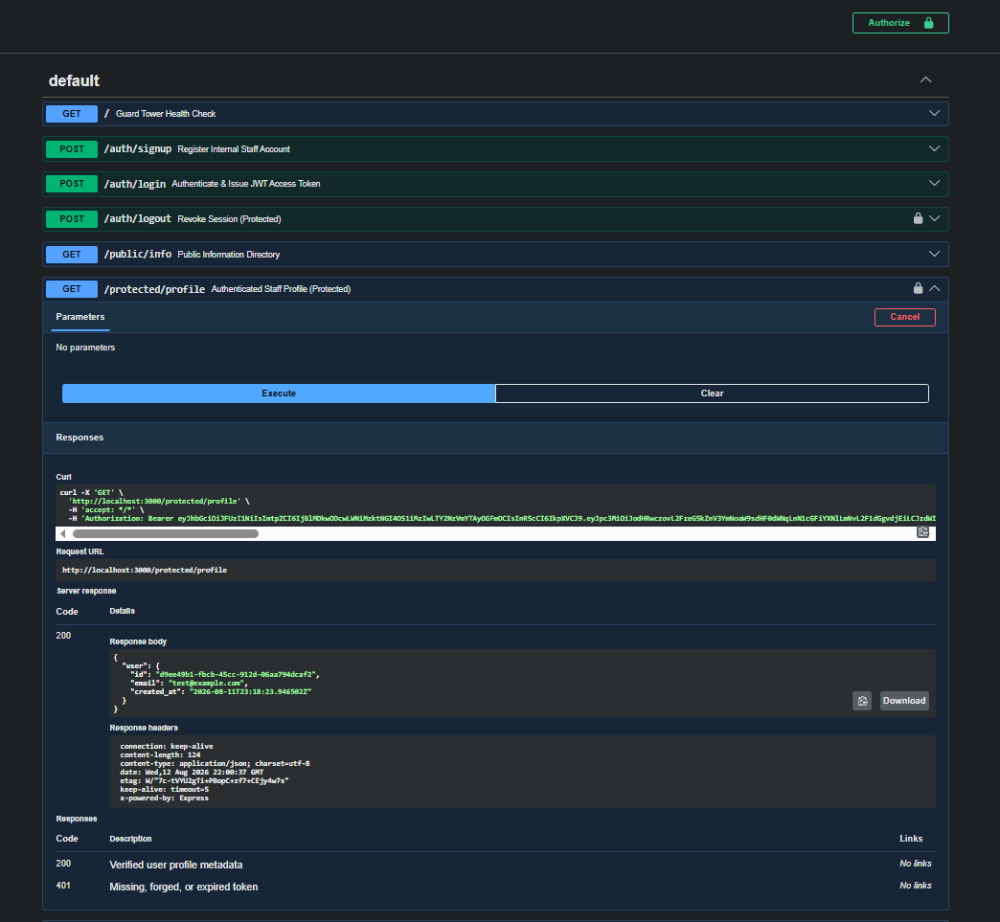

🇰🇪 Secure SME Backend & Supabase Auth API

A production-ready Express backend providing cryptographic identity management, reusable JWT middleware gates, and ODPC-aligned data security controls for Kenyan SMEs.

📌 Executive Summary & Proof Statement

"I build secure software that automatically extracts text from messy business files (like PDF invoices, orders, and delivery notes) and saves them directly to company databases with zero manual typing."

Designed for Kenyan professional service firms and SMEs, this API establishes a zero-trust network perimeter. It ensures that sensitive business documents and operational records are protected behind cryptographically signed Supabase JWT access tokens while adhering to Office of the Data Protection Commissioner (ODPC) guidelines on data sovereignty and access control.

🏛 Architecture & Security Model

The system enforces perimeter defense using a zero-trust model:

Centralized Identity Provider: Authentication is handled by Supabase Auth (OAuth 2.0 / OIDC), issuing cryptographically signed JWT access tokens.

Automated Middleware Gate (requireAuth): Every request to restricted endpoints passes through a single middleware function that inspects the token signature against Supabase before granting entry.

Audit-Ready Operations: Unverified or forged tokens are immediately rejected with 401 Unauthorized, preserving data integrity and audit logging.

🛠 Quickstart Guide (Setup in under 5 minutes)

1. Clone the Repository

git clone https://github.com/YOUR_GITHUB_USERNAME/YOUR_REPO_NAME.git
cd YOUR_REPO_NAME

2. Install Dependencies

npm install

3. Configure Environment Variables

Copy .env.example to create your local .env file:

cp .env.example .env

Fill in your Supabase credentials inside .env:

SUPABASE_URL=https://your-project-id.supabase.co
SUPABASE_KEY=your-supabase-anon-key
PORT=3000

4. Start the Server

node server.js

The server will boot on http://localhost:3000 with the security perimeter active.

📋 API Reference Table

| Method | Endpoint | Auth Required? | Description | Expected Status |
| :--- | :--- | :--- | :--- | :--- |
| `GET` | `/` | ❌ No | Guard Tower health check | `200 OK` |
| `POST` | `/auth/signup` | ❌ No | Register new internal staff account | `201 Created` |
| `POST` | `/auth/login` | ❌ No | Authenticate credentials & issue JWT | `200 OK` |
| `GET` | `/public/info` | ❌ No | Public informational directory | `200 OK` |
| `GET` | `/protected/profile` | 🔒 Yes | Returns authenticated user metadata | `200 OK` / `401 Unauthorized` |
| `GET` | `/protected/dashboard` | 🔒 Yes | Secure SME operational dashboard | `200 OK` / `401 Unauthorized` |
| `POST` | `/auth/logout` | 🔒 Yes | Revokes active session | `204 No Content` |
| `GET` | `/docs` | ❌ No | Interactive Swagger UI documentation | `200 OK` |

🔒 Interactive Swagger UI (/docs)

Visit http://localhost:3000/docs in your browser to interact with the live API documentation:

Click the Authorize 🔓 button at the top right of the Swagger interface.

Enter your JWT access token obtained from POST /auth/login.

Test protected endpoints (/protected/profile, /protected/dashboard) directly from the browser.

🛡 Kenyan ODPC Data Compliance & Sovereignty

Data Minimization (Section 25, Data Protection Act 2019): Endpoints parse and process only explicitly validated JSON payloads required for business workflows.

Access Control & Accountability: Every protected endpoint requires a verified user ID tied to an audit log entry before operational access is granted.

Secrets Management: Cryptographic keys and database connection strings are injected purely via environment variables (.env), keeping sensitive credentials out of version control.

👤 Author & Contact

Ernest Mwang'ombe

IT Consultant & Backend AI Systems Engineer

(Nairobi, Kenya)

Specializing in business process automation, secure API integration, and local data compliance for Kenyan SMEs.

💬 Need a local security or workflow automation audit for your firm?
Contact me via WhatsApp or email to set up a free technical consultation.